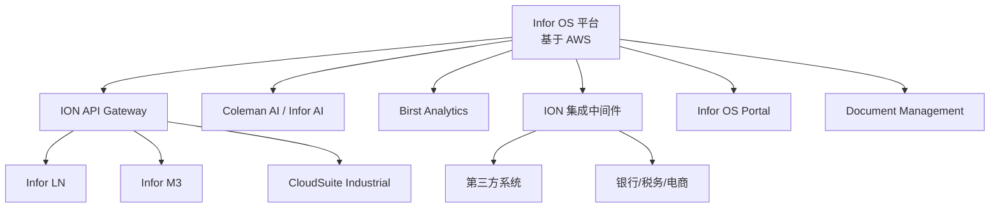

# Infor OS (平台)

> Infor OS 是 Infor 的云操作系统，为所有 Infor 云产品提供统一的运行平台、API 网关、集成能力和用户体验。

---

## 平台概述

| 项目 | 说明 |
|------|------|
| **类型** | 云操作系统 / PaaS 平台 |
| **云基础设施** | AWS（Amazon Web Services） |
| **核心能力** | API 网关、数据管理、集成、安全、UX |
| **支持产品** | 所有 CloudSuite 产品 |

## 核心组件

### 集成与 API

| 组件 | 说明 |
|------|------|
| **ION API Gateway** | RESTful API 管理、策略配置、代理端点管理 |
| **ION** | 基于事件的集成中间件，预构建连接器 |
| **ION Data Lake** | 跨应用数据聚合与分析 |

### 协作与导航

| 组件 | 说明 |
|------|------|
| **Infor OS Portal** | 统一门户（取代 Ming.le），支持插件配置和应用集成 |
| **Ming.le**（已弃用） | 旧版社交协作平台，已被 OS Portal 取代 |

### AI 与分析

| 组件 | 说明 |
|------|------|
| **Infor Coleman AI**（现 Infor AI） | 人工智能平台，预测与规范性模型 |
| **Birst Analytics** | 云端 BI 和数据分析平台 |

---

## 第三方资源速查

### 博客与教程

| 资源 | 说明 |
|------|------|
| [FullOnBaan LN Playbook](resources/blogs.md) | ION 工作流、API Gateway、BOD 集成知识库 |
| [Infor Developer Portal](resources/blogs.md) | 官方开发者门户（含 OS、ION、Ming.le API） |
| [DCKAP Blog](resources/blogs.md) | ION vs MuleSoft 中间件选型、集成策略 |
| [SamA Consulting Blog](resources/blogs.md) | ION 集成深度技术文章 |

### 工具与插件

| 工具 | 说明 |
|------|------|
| [ION API Gateway](resources/tools.md) | API 管理（策略配置、代理端点、安全控制） |
| [ION BOD 处理工具](resources/tools.md) | BOD 消息处理指南（XML 映射、转换规则） |
| [ION Development Guide](resources/tools.md) | ION 开发指南 |
| [Infor CI/CD Utility](resources/tools.md) | Infor 云 CI/CD 部署工具 |
| [Infor OS Portal](resources/tools.md) | OS 门户配置指南 |
| [Infor IPA (iPaaS)](resources/tools.md) | Infor 流程自动化平台 |
| [ION EDI Tools](resources/tools.md) | EDI 连接器和工具 |
| [ION API SDK (Java)](resources/tools.md) | ION API Gateway Java SDK |

---

## 平台架构

---

## 相关产品

- [Infor LN](ln.md) — 离散制造 ERP
- [Infor M3](m3.md) — 流程制造 ERP
- [CloudSuite Industrial](csi.md) — 中端离散制造 ERP

---

**最后更新**：2026-05-07
