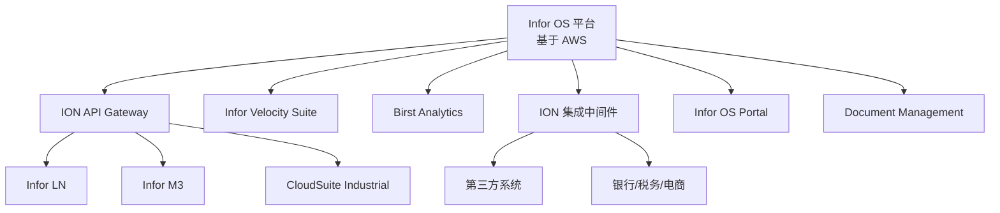

# Infor OS (平台)

> Infor OS 是 Infor 的云操作系统，为所有 Infor 云产品提供统一的运行平台、API 网关、集成能力和用户体验。

---

## 平台概述

| 项目 | 说明 |
|------|------|
| **类型** | 云操作系统 / PaaS 平台 |
| **云基础设施** | AWS（Amazon Web Services） |
| **核心能力** | API 网关、数据管理、集成、安全、UX |
| **支持产品** | 所有 CloudSuite 产品 |

## 核心组件

### 集成与 API

| 组件 | 说明 |
|------|------|
| **ION API Gateway** | RESTful API 管理、策略配置、代理端点管理 |
| **ION** | 基于事件的集成中间件，预构建连接器 |
| **ION Data Lake** | 跨应用数据聚合与分析 |

### 协作与导航

| 组件 | 说明 |
|------|------|
| **Infor OS Portal** | 统一门户（取代 Ming.le），支持插件配置和应用集成 |
| **Ming.le**（已弃用） | 旧版社交协作平台，已被 OS Portal 取代 |

### AI 与分析（Infor Velocity Suite）

> 💡 2026 起，原 **Coleman AI** 能力演进为 **Infor Industry AI Agents** 与 **Infor Agentic Orchestrator**，统一归入 **Infor Velocity Suite**（与每个 CloudSuite 搭配的 AI 加速器）。全站仍用「Infor AI（原 Coleman AI）」作为历史桥接口径。

| 组件 / 能力 | 说明 | 状态 |
|------|------|------|
| **Infor Velocity Suite** | Infor 的 AI 加速器，把 Industry AI Agents、流程挖掘、自动化、治理与行业专家打包为统一方案；按年订阅（不限用量），附一年 CareFor 托管服务 | 已发布 |
| **Infor Industry AI Agents** | 面向行业的角色化智能体（财务/采购/仓储/销售/HR 等），基于行业云套件、流程目录与领域语言模型，而非通用横向模型 | 已发布 |
| **Infor Agentic Orchestrator** | 监督智能体跨流程协调多个任务智能体、保持上下文与治理；以业务级流程 API 调用（如一步创建采购单）降低幻觉与 token 成本 | Limited availability（2026-10） |
| **Agent Factory** | 用自有提示、工具与护栏构建自定义智能体的工厂 | 已发布 |
| **GenAI Assistant** | 在员工既有应用中对话式访问实时数据并执行动作 | 已发布 |
| **GenAI Knowledge Hub** | 基于已发布 Infor 知识（文档/用户指南/发布报告）作答，而非模型臆测 | GA（2026-10） |
| **Infor IQ** | 语义层，为所有智能体提供一致的业务理解；350+ 预置用例开箱即用 | 已发布 |
| **Process Mining** | 诊断层（先发现瓶颈，再自动化），已引入 GenAI 流程摘要 | 已发布 |
| **Value+** | 预置自动化目录，可在 CloudSuite 内按角色/流程/行业浏览启用 | 已发布 |
| **MCP 连接** | 经 ION API Gateway 把任意外部 API 转为 MCP 工具，直连 Data Fabric / Process Intelligence / EPM / RPA / Birst | Limited availability（2026-10） |
| **Infor AI（原 Coleman AI）** | 历史品牌名（2025.x 含 Microsoft Copilot 集成、预测分析、自然语言查询 NLQ） | 演进中 |
| **Birst Analytics** | 云端 BI 与数据分析平台（详见 [Infor Birst](birst.md)） | 已发布 |

---

## 第三方资源速查

### 博客与教程

| 资源 | 说明 |
|------|------|
| [FullOnBaan LN Playbook](../resources/blogs.md) | ION 工作流、API Gateway、BOD 集成知识库 |
| [Infor Developer Portal](../resources/blogs.md) | 官方开发者门户（含 OS、ION、Ming.le API） |
| [DCKAP Blog](../resources/blogs.md) | ION vs MuleSoft 中间件选型、集成策略 |
| [SamA Consulting Blog](../resources/blogs.md) | ION 集成深度技术文章 |

### 工具与插件

| 工具 | 说明 |
|------|------|
| [ION API Gateway](../resources/tools.md) | API 管理（策略配置、代理端点、安全控制） |
| [ION BOD 处理工具](../resources/tools.md) | BOD 消息处理指南（XML 映射、转换规则） |
| [ION Development Guide](../resources/tools.md) | ION 开发指南 |
| [Infor CI/CD Utility](../resources/tools.md) | Infor 云 CI/CD 部署工具 |
| [Infor OS Portal](../resources/tools.md) | OS 门户配置指南 |
| [Infor IPA (iPaaS)](../resources/tools.md) | Infor 流程自动化平台 |
| [ION EDI Tools](../resources/tools.md) | EDI 连接器和工具 |
| [ION API SDK (Java)](../resources/tools.md) | ION API Gateway Java SDK |

---

## 平台架构

```mermaid
graph TB
    A[Infor OS 平台<br/>基于 AWS] --> B[ION API Gateway]
    A --> C[Infor Velocity Suite]
    A --> D[Birst Analytics]
    A --> E[ION 集成中间件]
    A --> F[Infor OS Portal]
    A --> G[Document Management]

    B --> H[Infor LN]
    B --> I[Infor M3]
    B --> J[CloudSuite Industrial]

    E --> K[第三方系统]
    E --> L[银行/税务/电商]
```

---

## 相关产品

- [Infor LN](ln.md) — 离散制造 ERP
- [Infor M3](m3.md) — 流程制造 ERP
- [CloudSuite Industrial](csi.md) — 中端离散制造 ERP

---

**最后更新**：2026-10-08
