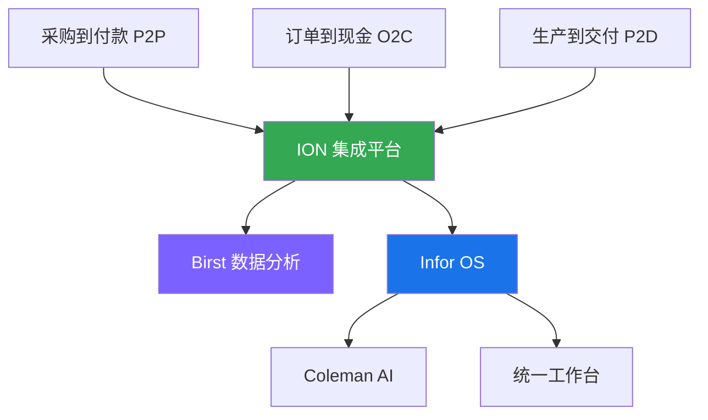
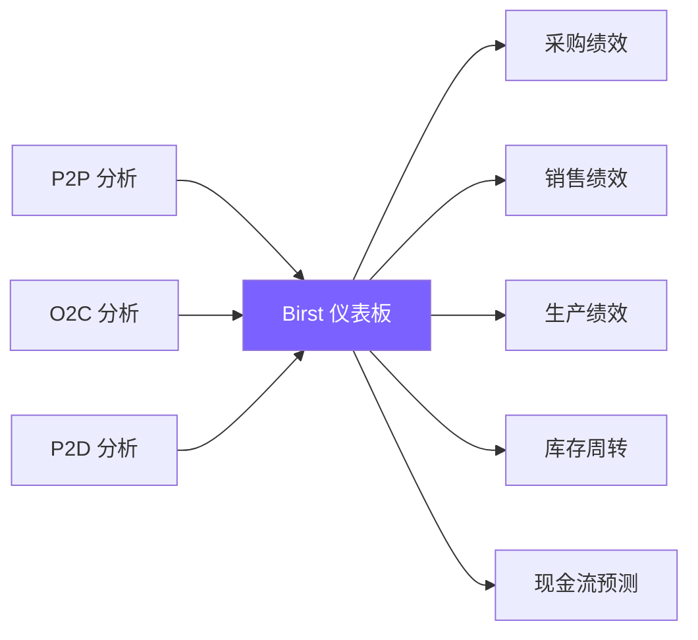

# 🔄 端到端业务流程

> 通过 Mermaid 流程图，理解 Infor 产品如何协同完成完整的业务循环。

---

## 🛒 采购到付款 (Procure to Pay, P2P)

采购到付款流程涵盖从需求提出到供应商付款的完整循环。

### 涉及产品与 BOD

| 步骤 | 产品 | BOD 类型 | BOD 名称 |
|------|------|----------|----------|
| 采购申请 | LN/M3 | Process | `ProcessPurchaseRequisition` |
| 采购订单 | LN/M3 | Process | `ProcessPurchaseOrder` |
| 供应商确认 | 供应商门户 | Response | `ProcessPurchaseOrderResponse` |
| 到货接收 | WMS | Process | `ProcessReceipt` |
| 发票校验 | LN/M3 | Process | `ProcessInvoice` |
| 付款审批 | LN/M3 | - | - |
| 数据分析 | Birst | Sync | `SyncFinancialData` |

---

## 💰 订单到现金 (Order to Cash, O2C)

订单到现金流程涵盖从客户询价到收到付款的完整循环。

### 涉及产品与 BOD

| 步骤 | 产品 | BOD 类型 | BOD 名称 |
|------|------|----------|----------|
| 客户询价 | CRM | Process | `ProcessQuoteRequest` |
| 报价单 | CPQ | Process | `ProcessQuote` |
| 销售订单 | LN/M3 | Process | `ProcessSalesOrder` |
| 库存分配 | WMS | Sync | `SyncInventoryBalance` |
| 拣货 | WMS | Process | `ProcessPickList` |
| 发货 | WMS | Process | `ProcessShipment` |
| 开具发票 | LN/M3 | Process | `ProcessInvoice` |
| 营收分析 | Birst | Sync | `SyncRevenueData` |

---

## 🏭 生产到交付 (Produce to Deliver, P2D)

生产到交付流程涵盖从生产计划到产品交付给客户的完整循环。

### 涉及产品与 BOD

| 步骤 | 产品 | BOD 类型 | BOD 名称 |
|------|------|----------|----------|
| 生产计划 | LN | Process | `ProcessProductionPlan` |
| 物料需求计划 | LN | Process | `ProcessMRP` |
| 生产订单 | LN | Process | `ProcessProductionOrder` |
| 领料 | WMS | Process | `ProcessMaterialIssue` |
| 生产执行 | Factory Track | Process | `ProcessProductionActivity` |
| 完工入库 | LN + WMS | Process | `ProcessProductionReceipt` |
| 发货 | WMS | Process | `ProcessShipment` |
| 生产分析 | Birst | Sync | `SyncProductionData` |

---

## 🔄 跨流程数据集成

三个核心流程通过 **ION** 实现数据共享和协同。

### 数据共享示例

| 数据流 | 来源 | 目标 | 用途 |
|--------|------|------|------|
| 客户主数据 | CRM | LN/M3 | 销售订单客户信息 |
| 物料主数据 | LN/M3 | WMS | 仓储管理物料信息 |
| 供应商主数据 | LN/M3 | WMS | 收货供应商信息 |
| 库存余额 | WMS | LN/M3 | 销售订单可用性检查 |
| 生产进度 | Factory Track | LN | 生产订单状态更新 |

---

## 📊 Birst 分析场景

端到端流程的数据最终汇集到 **Birst** 进行分析。

### 典型分析主题

| 分析主题 | 关键指标 | 数据来源 |
|---------|---------|---------|
| **采购绩效** | 采购周期、节约金额、供应商评分 | P2P 流程 |
| **销售绩效** | 订单履约率、应收账款周转、客户满意度 | O2C 流程 |
| **生产绩效** | 产能利用率、良品率、在制品库存 | P2D 流程 |
| **库存周转** | 库存天数、呆滞库存、库存准确率 | P2P + O2C |
| **现金流预测** | 应付账款、应收账款、净现金流 | P2P + O2C |

---

## 💡 流程优化建议

### 1. 减少手工数据录入
- ✅ 使用 ION 自动同步主数据
- ✅ 配置 BOD 自动触发后续流程
- ✅ 使用条码/RFID 自动采集现场数据

### 2. 提高流程可视化
- ✅ 在 Birst 中创建端到端流程仪表板
- ✅ 使用 ION Desk 监控 BOD 流转状态
- ✅ 配置异常告警（如订单超期未发货）

### 3. 持续流程改进
- ✅ 定期分析 Birst 流程绩效报告
- ✅ 识别瓶颈步骤（如采购审批耗时过长）
- ✅ 优化或自动化瓶颈步骤

---

## 📚 延伸阅读

- [ION 集成解析](ion-integration.md) - 深入了解 ION 平台
- [Infor OS 架构](index.md) - 了解核心平台架构
- [Birst 用户指南](https://docs.infor.com/birst/) - 学习如何创建分析报表

---

## 📝 更新记录

- **2026-05-18**：初始版本创建
- 包含 P2P、O2C、P2D 流程图和数据集成说明

---

> 有疑问或建议？请在 [GitHub Issues](https://github.com/cuiwenyuan/infor-ecosystem-open-resources/issues) 中提出。
