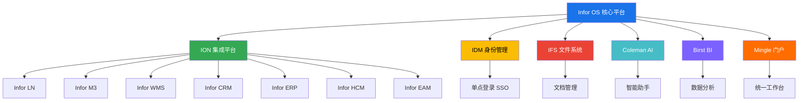
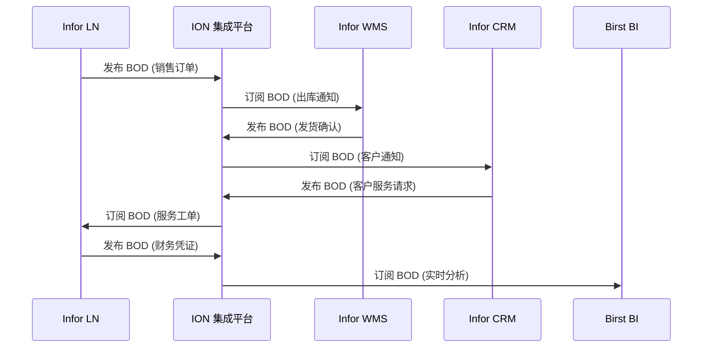
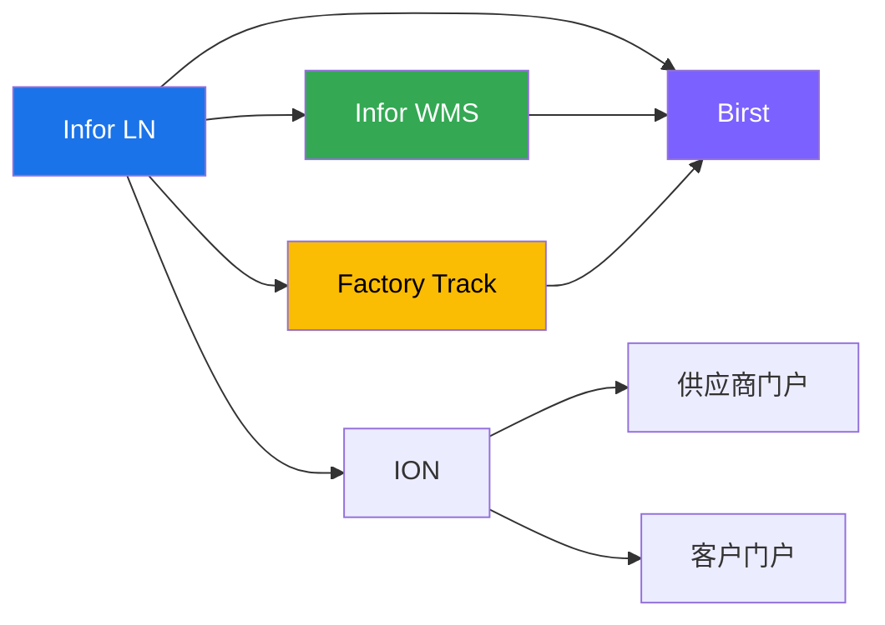
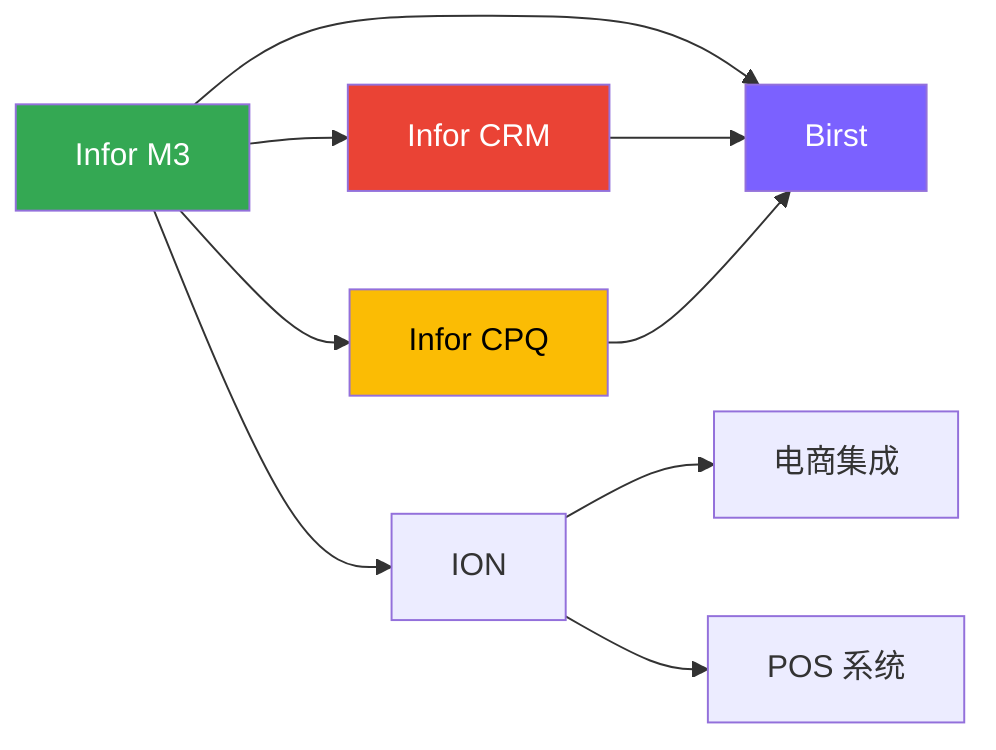
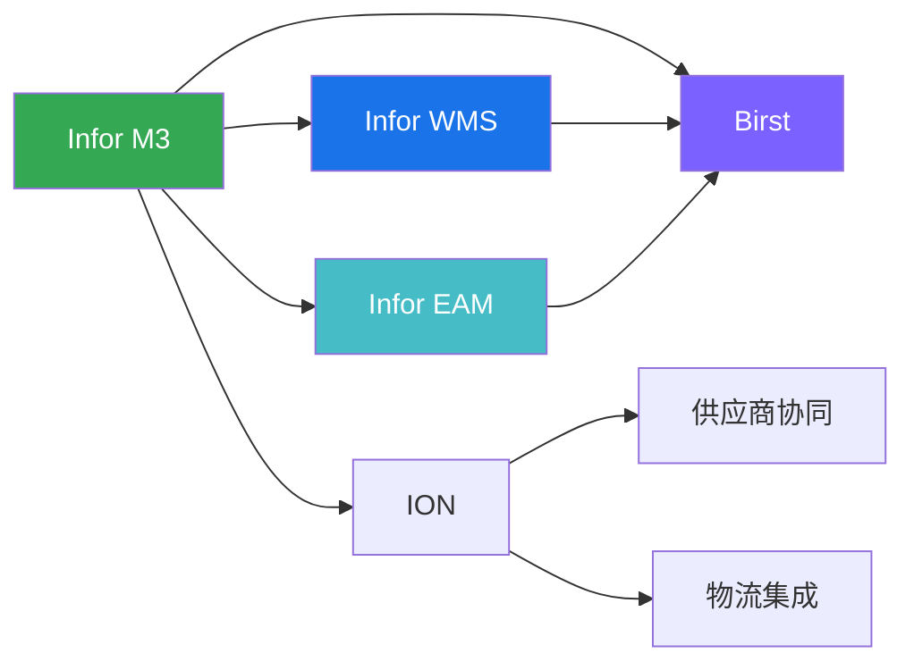
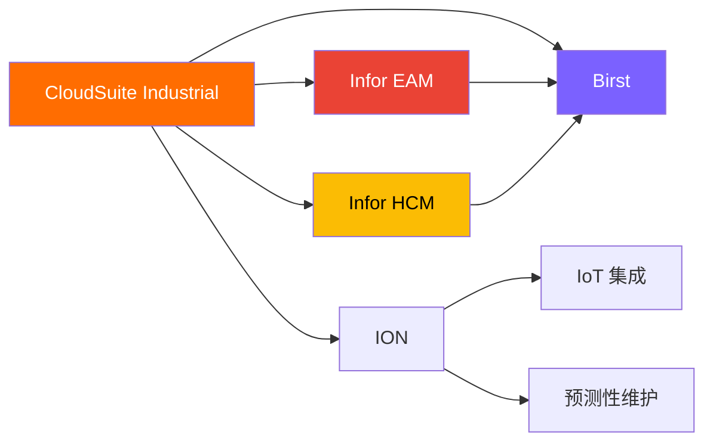

# 🌐 Infor 生态系统图谱

> 一张图看懂 Infor 产品如何协同工作——从核心平台到行业解决方案。

---

## 🏗️ Infor OS 核心平台架构

Infor OS (Operating System) 是 Infor 生态系统的核心平台，提供统一的技术基础、集成能力和用户体验。

### 核心组件说明

| 组件 | 全称 | 作用 |
|------|------|------|
| **Infor OS** | Infor Operating System | 统一技术平台，提供集成、身份、AI、分析等基础能力 |
| **ION** | Intelligent Open Network | 集成平台，通过 BOD 实现产品间数据流转 |
| **IDM** | Identity Management | 身份与访问管理，支持 SSO 和权限控制 |
| **IFS** | Infor File Storage | 统一文档管理系统 |
| **Coleman** | Coleman AI | 人工智能助手，支持智能推荐和自动化 |
| **Birst** | Birst BI | 云端 BI 平台，提供实时分析 |
| **Mingle** | Mingle Portal | 统一用户工作台，集成所有应用 |

---

## 🔗 ION 集成架构

ION (Intelligent Open Network) 是 Infor 的集成中枢，通过标准化的 BOD (Business Object Document) 实现产品间的无缝集成。

### BOD 集成优势

- ✅ **标准化**：统一的 BOD 格式，减少定制开发
- ✅ **实时性**：事件驱动架构，数据实时同步
- ✅ **可扩展**：轻松添加新的集成端点
- ✅ **可视化**：ION Desk 提供集成监控和排查工具

---

## 📊 产品关系矩阵

下表展示 Infor 核心产品之间的集成关系：

| 产品 | LN | M3 | WMS | CRM | HCM | EAM | Birst | CPQ |
|------|----|----|-----|-----|-----|-----|-------|------|
| **LN** | - | ✅ | ✅ | 🔧 | ✅ | 🔧 | ✅ | ✅ |
| **M3** | ✅ | - | ✅ | ✅ | ✅ | 🔧 | ✅ | ✅ |
| **WMS** | ✅ | ✅ | - | - | - | ✅ | 🔧 | - |
| **CRM** | 🔧 | ✅ | - | - | - | - | ✅ | ✅ |
| **HCM** | ✅ | ✅ | - | - | - | - | 🔧 | - |
| **EAM** | 🔧 | 🔧 | ✅ | - | - | - | ✅ | - |
| **Birst** | ✅ | ✅ | 🔧 | ✅ | 🔧 | ✅ | - | - |
| **CPQ** | ✅ | ✅ | - | ✅ | - | - | 🔧 | - |

**图例**：
- ✅ = 原生集成（开箱即用）
- 🔧 = 需要配置
- - = 不适用

> **提示**：将鼠标悬停在产品名称上，可以点击跳转到对应的产品详情页。

---

## 🎯 典型解决方案组合

根据不同行业和场景，Infor 产品可以灵活组合形成完整的解决方案。

### 🏭 制造业组合

**适用场景**：
- 离散制造（汽车、电子、机械）
- 按单设计（ETO）企业
- 需要精细化仓储管理的制造商

**核心价值**：
- LN 提供核心 ERP 功能
- WMS 实现仓储精细化作业
- Factory Track 支持车间现场管理
- Birst 提供实时生产分析

---

### 🛒 零售业组合

**适用场景**：
- 服装零售
- 食品零售
- 全渠道零售企业

**核心价值**：
- M3 支持多语言、多货币、多公司
- CRM 提供全渠道客户管理
- CPQ 实现复杂产品配置
- Birst 分析销售和客户数据

---

### 🚚 分销业组合

**适用场景**：
- 批发分销
- 医药分销
- 食品分销

**核心价值**：
- M3 支持复杂的分销流程
- WMS 优化仓储和物流
- EAM 管理配送设备
- Birst 分析库存和供应链数据

---

### 🏗️ 资产密集型行业组合

**适用场景**：
- 公用事业
- 石油天然气
- 交通运输

**核心价值**：
- CloudSuite Industrial 提供核心 ERP
- EAM 管理关键设备和资产
- HCM 管理现场服务人员
- Birst 分析资产绩效

---

## 🔄 端到端业务流程

Infor 产品通过 ION 实现端到端的业务流程集成。

### 订单到现金 (Order to Cash)

### 采购到付款 (Procure to Pay)

### 生产到交付 (Produce to Deliver)

> 💡 **提示**：查看 [端到端业务流程](data-flow.md) 页面，了解更详细的流程图和数据流转说明。

---

## 🚀 快速开始

### 如果你想...

- 🔍 **了解 ION 集成原理** → 阅读 [ION 集成解析](ion-integration.md)
- 📊 **查看完整业务流程** → 阅读 [端到端业务流程](data-flow.md)
- 🏢 **查看具体产品详情** → 访问 [按产品浏览](../by-product/ln.md)
- 🎯 **寻找适合的方案** → 阅读 [解决方案对比](../competitor/ln-vs-sap.md)

---

## 📚 相关资源

- [Infor OS 官方文档](https://docs.infor.com/os/)
- [ION 集成指南](https://docs.infor.com/ion/)
- [Birst 用户指南](https://docs.infor.com/birst/)
- [Infor 产品矩阵](../products/by-product-line/index.md)

---

## 📝 更新记录

- **2026-05-18**：初始版本创建
- 包含 Infor OS 架构图、产品关系矩阵、典型解决方案组合

---

> 有问题或建议？请在 [GitHub Issues](https://github.com/cuiwenyuan/infor-ecosystem-open-resources/issues) 中提出。
