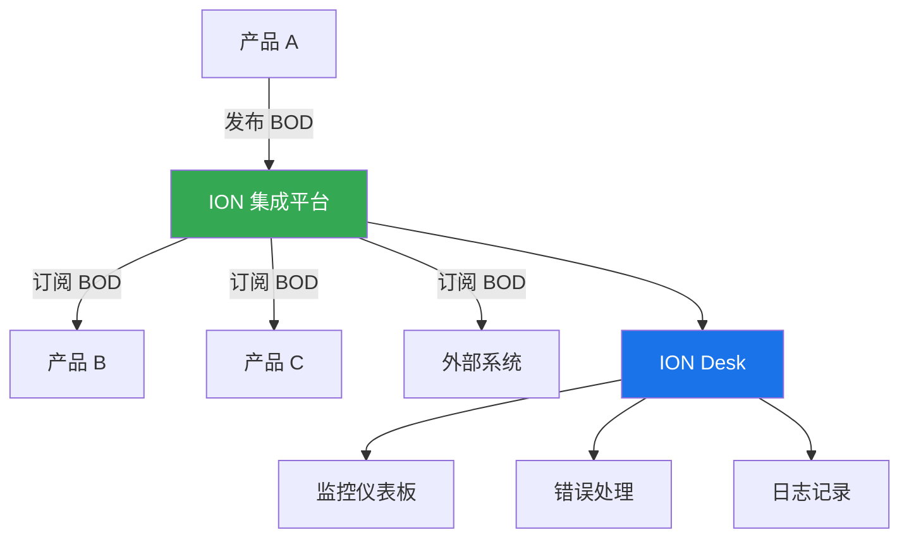
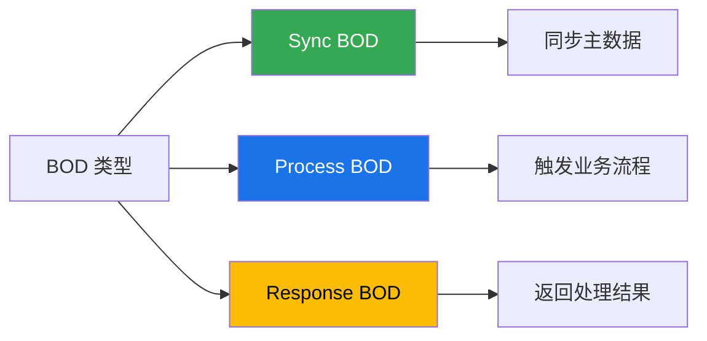
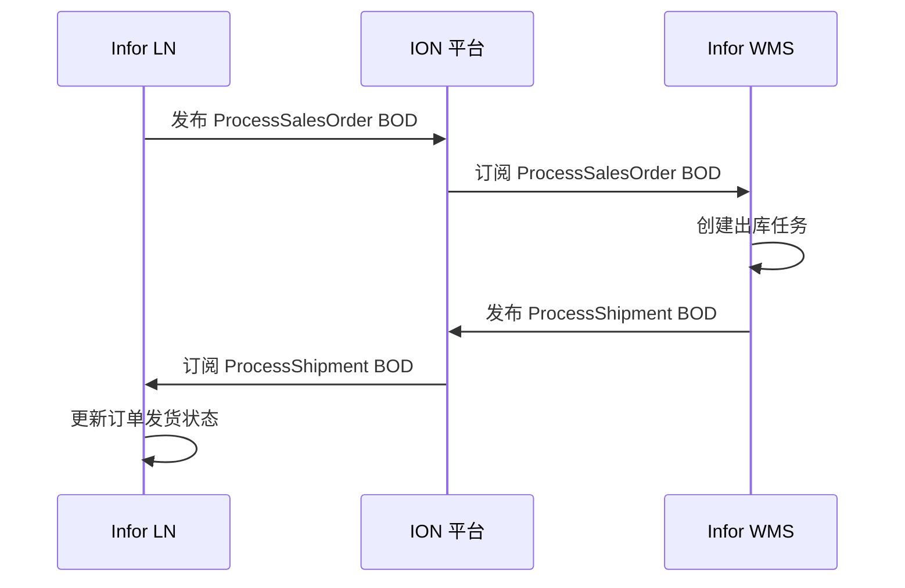
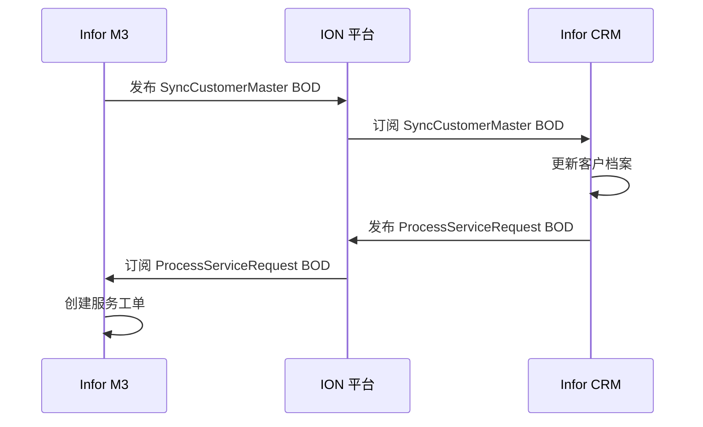
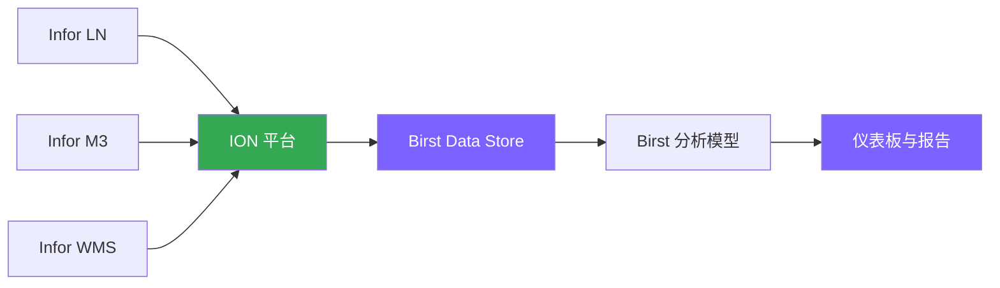
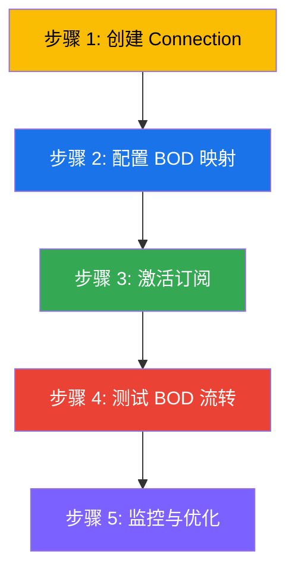

# 🔗 ION 集成解析

> ION (Intelligent Open Network) 是 Infor 的集成中枢，通过标准化的 BOD 实现产品间的无缝数据流转。

---

## 🤔 什么是 ION？

ION 是 Infor 的**云端集成平台**，提供：

- 🔄 **事件驱动架构**：产品间通过发布/订阅 BOD 实现实时集成
- 🔌 **标准化接口**：统一的 BOD (Business Object Document) 格式
- 📊 **可视化监控**：ION Desk 提供集成流程监控和故障排查
- 🌐 **云端管理**：无需本地部署集成中间件



---

## 📊 ION Desk 简介

ION Desk 是 ION 的**管理控制台**，提供：

### 核心功能

| 功能模块 | 作用 |
|---------|------|
| **Connections** | 管理产品间的连接配置 |
| **BOD Monitor** | 监控 BOD 流转状态 |
| **Error Handler** | 查看和处理集成错误 |
| **Activity Tracker** | 查看 BOD 处理历史 |
| **Reporting** | 生成集成性能报告 |

### 访问方式

1. 登录 [Infor CloudSuite](https://www.infor.com/products/cloudsuite)
2. 打开 **ION Desk** 应用
3. 使用 Infor OS 账号单点登录 (SSO)

> 💡 **提示**：需要有效的 Infor 支持合同才能访问 ION Desk。

---

## 📋 BOD 类型与结构

BOD (Business Object Document) 是 ION 的**标准数据格式**。

### BOD 三大类型



#### 1. Sync BOD（同步 BOD）
- **用途**：同步主数据（客户、物料、供应商等）
- **方向**：从源系统 → ION → 目标系统
- **示例**：`SyncCustomerMaster`（同步客户主数据）

#### 2. Process BOD（处理 BOD）
- **用途**：触发业务流程（创建订单、发货通知等）
- **方向**：从源系统 → ION → 目标系统
- **示例**：`ProcessSalesOrder`（处理销售订单）

#### 3. Response BOD（响应 BOD）
- **用途**：返回处理结果（成功/失败/错误信息）
- **方向**：从目标系统 → ION → 源系统
- **示例**：`ProcessSalesOrderResponse`（销售订单处理响应）

---

### BOD 结构示例

```xml
<!-- SyncCustomerMaster BOD 示例 -->
<SyncCustomerMaster>
  <ApplicationArea>
    <Sender>
      <LogicalID>Infor-LN</LogicalID>
    </Sender>
    <CreationDateTime>2026-05-18T06:00:00Z</CreationDateTime>
  </ApplicationArea>
  <DataArea>
    <Sync>
      <TenantId>12345</TenantId>
      <CustomerMaster>
        <CustomerPartyMaster>
          <ID>10001</ID>
          <Name>ABC 公司</Name>
          <CustomerTypeCode>EndCustomer</CustomerTypeCode>
        </CustomerPartyMaster>
      </CustomerMaster>
    </Sync>
  </DataArea>
</SyncCustomerMaster>
```

> 📝 **注意**：实际 BOD 结构因产品版本和配置而异，请参考官方文档。

---

## 🔄 常见集成场景

### 场景 1：LN → WMS（ERP 到仓储）



**涉及 BOD**：
- `ProcessSalesOrder`（销售订单）
- `ProcessShipment`（发货通知）
- `SyncItemMaster`（物料主数据同步）

---

### 场景 2：M3 → CRM（ERP 到客户管理）



**涉及 BOD**：
- `SyncCustomerMaster`（客户主数据）
- `ProcessServiceRequest`（服务请求）
- `SyncSalesOrder`（销售订单同步）

---

### 场景 3：ERP → Birst（数据到分析）



**数据流**：
1. ION 收集各产品的业务数据 BOD
2. Birst 定期从 ION 抽取数据
3. Birst 建模并生成分析报告

---

## ⚙️ 配置要点（概览级）

### ION 集成配置步骤



#### 步骤 1：创建 Connection（连接）
- 在 ION Desk 中配置源系统和目标系统
- 配置认证方式（通常自动使用 Infor OS 认证）

#### 步骤 2：配置 BOD 映射
- 定义 BOD 字段映射关系
- 处理字段差异和数据转换

#### 步骤 3：激活订阅
- 在 ION Desk 中激活 BOD 订阅
- 设置过滤条件（如只订阅特定类型的订单）

#### 步骤 4：测试 BOD 流转
- 在源系统中创建测试数据
- 在 ION Desk 中监控 BOD 状态
- 在目标系统中验证数据接收

#### 步骤 5：监控与优化
- 定期检查 BOD Monitor
- 处理错误和异常
- 优化 BOD 处理性能

---

## 📚 延伸阅读

- [端到端业务流程](data-flow.md) - 查看完整业务流程图
- [Infor OS 架构](index.md) - 了解 Infor OS 核心平台
- [ION 官方文档](https://docs.infor.com/ion/)

---

## 📝 更新记录

- **2026-05-18**：初始版本创建
- 包含 ION 简介、BOD 类型、常见集成场景、配置要点

---

> 有疑问或建议？请在 [GitHub Issues](https://github.com/cuiwenyuan/infor-ecosystem-open-resources/issues) 中提出。
