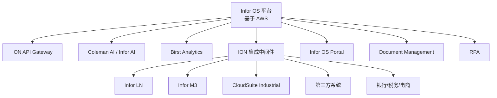

# 按技术平台分类

> 本页面按**技术平台**分类展示 Infor 的技术架构，并为每个平台组件提供第三方资源链接。

---

## Infor OS 平台

**Infor 云操作系统** — 所有 Infor 产品的统一运行平台。

| 能力 | 说明 |
|------|------|
| 云基础设施 | 基于 AWS |
| API 网关 | RESTful API 和 SOAP API 管理 |
| 数据管理 | 统一数据模型和集成 |
| 用户体验 | 统一的用户界面和导航 |
| 安全 | 统一的安全模型和身份管理 |

📌 **详细页面**：[Infor OS](../by-product/infor-os.md)

🔗 **相关资源**：
- 📝 博客：[FullOnBaan Playbook](../resources/blogs.md)（API Gateway、BOD 集成） | [Infor Developer Portal](../resources/blogs.md)
- 🔧 工具：[ION API Gateway](../resources/tools.md) | [Infor CI/CD Utility](../resources/tools.md) | [Infor IPA (iPaaS)](../resources/tools.md)

---

## ION（智能开放网络）

**集成中间件** — Infor 的核心集成平台和消息传递系统。

| 功能 | 说明 |
|------|------|
| 应用间集成 | Infor 模块之间以及与第三方系统集成 |
| 基于事件的消息传递 | 发布/订阅架构 |
| 预构建连接器 | EDI、银行、税务、电子商务 |
| API 管理 | 自定义集成的 API 管理 |
| 数据湖 | 跨应用数据聚合 |
| 工作流编排 | 跨应用业务流程编排 |

### BOD（业务对象文档）

ION 的核心消息格式，用于 Infor 产品间以及与第三方系统间的数据交换。

🔗 **相关资源**：
- 📝 博客：[FullOnBaan LN Playbook](../resources/blogs.md)（ION 工作流、BOD 集成） | [DCKAP Blog](../resources/blogs.md)（ION vs MuleSoft） | [Netray ION BOD](../resources/blogs.md)
- 🔧 工具：[ION API Gateway](../resources/tools.md) | [ION BOD 处理工具](../resources/tools.md) | [ION Development Guide](../resources/tools.md) | [ION EDI Tools](../resources/tools.md) | [ION API SDK (Java)](../resources/tools.md)

---

## Coleman AI（现 Infor AI）

**人工智能平台** — Infor 的 AI/ML 平台，提供预测分析和智能自动化。

| 功能 | 说明 |
|------|------|
| 对话式 AI | ERP 查询和操作的聊天机器人界面 |
| 预测分析 | 需求预测、维护预测、异常检测 |
| 流程自动化 | 智能文档处理、自动分类 |
| 建议引擎 | 基于运营数据模式的建议操作 |

🔗 **相关资源**：
- 📝 博客：[Infor Documentation Central](../resources/blogs.md)
- 🔧 工具：[Infor AI User Guide](../resources/tools.md) | [Infor Coleman AI](../resources/tools.md)

---

## Birst Analytics

**商业智能平台** — Infor 的云端 BI 和数据分析平台。

| 功能 | 说明 |
|------|------|
| 预建仪表板 | 行业特定的预建 KPI 仪表板 |
| 临时报告 | 拖放式报告构建器 |
| 数据发现 | 网络化分析架构 |
| 移动分析 | 响应式仪表板 |
| 自动洞察 | 趋势和异常自动突出 |
| 数据混合 | 结合 Infor 数据与外部数据源 |

🔗 **相关资源**：
- 📝 博客：[Infor Documentation Central](../resources/blogs.md)
- 🔧 工具：[Infor Birst](../resources/tools.md)

---

## Infor OS Portal（原 Ming.le）

**协作与统一导航** — 所有 CloudSuite 应用的统一入口。

| 功能 | 说明 |
|------|------|
| 统一导航 | CloudSuite 应用的统一导航 |
| 社交协作 | 活动流和团队工作区 |
| 通知和警报 | 跨模块通知和警报 |
| 上下文敏感访问 | 相关信息和操作的智能访问 |

> **注意**：Ming.le 已被 Infor OS Portal 取代。

🔗 **相关资源**：
- 🔧 工具：[Infor OS Portal 配置指南](../resources/tools.md) | [Ming.le（已弃用）](../resources/tools.md)

---

## 文档管理 (Document Management)

**文档管理系统** — 电子文档存储、审批工作流和 OCR 识别。

| 功能 | 说明 |
|------|------|
| 电子文档存储 | 版本控制 |
| 文档工作流 | 审批路由 |
| OCR/AI 驱动 | 发票等业务文档的智能捕获 |
| 跨应用集成 | 与所有 CloudSuite 模块集成 |

---

## RPA（机器人流程自动化）

**流程自动化** — 自动化重复性业务流程。

🔗 **相关资源**：
- 🏢 顾问：[mashfrog Group](../resources/consultants.md)
- 🔧 工具：[Infor RPA](../resources/tools.md) | [Infor RPA Tutorial](../resources/tools.md)

---

## 平台关系图

---

**💡 提示**：您也可以按 [业务功能](by-function/)、[产品线](by-product-line/) 或 [行业](by-industry/) 浏览产品。

**最后更新**：2026-05-07
