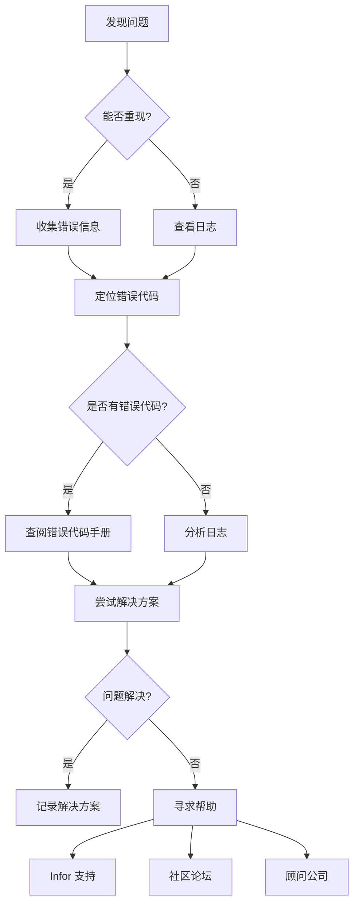

# 通用排查技巧

> Infor 产品通用故障排查方法和最佳实践。

---

## 排查流程

### 标准排查步骤



---

## 日志分析

### 日志文件位置

| 产品 | 日志位置 | 说明 |
|------|----------|------|
| **Infor LN** | `$BSE/log/` | LN 应用日志目录 |
| **Infor M3 (Cloud)** | ION Desk → Monitoring → Logs | M3 云日志 |
| **Infor ION** | ION Desk → Error BODs | ION 错误 BOD |
| **Infor WMS** | WMS Admin Console → Logs | WMS 应用日志 |
| **Infor OS** | Infor OS Portal → System Logs | OS 平台日志 |

### 日志分析技巧

```bash
# 1. 查看最新日志（Linux）
tail -f $BSE/log/ln.log

# 2. 搜索错误关键词
grep -i "error" $BSE/log/ln.log
grep -i "1306" $BSE/log/ln.log  # 搜索特定错误代码

# 3. 查看特定时间段的日志
grep "2026-05-11 14:" $BSE/log/ln.log

# 4. 统计错误频率
grep -i "error" $BSE/log/ln.log | sort | uniq -c | sort -rn
```

---

## 性能诊断

### 常见性能问题

| 问题类型 | 症状 | 排查方法 |
|----------|------|----------|
| **慢查询** | 报表/查询超时 | 检查 SQL 执行计划、索引使用 |
| **API 超时** | ION API 调用失败 | 检查网络延迟、API 响应时间 |
| **内存不足** | 应用崩溃、响应缓慢 | 检查 JVM 堆内存、GC 日志 |
| **死锁** | 错误 1306（记录锁定） | 查看数据库锁等待图 |

### 性能优化检查清单

- [ ] **数据库索引**：查询条件字段是否有索引？
- [ ] **DAL 代码**：是否使用了 `dal.set.where()` 限制结果集？
- [ ] **4GL 代码**：是否有无限循环或递归？
- [ ] **API 调用**：是否批量调用而不是逐条调用？
- [ ] **缓存**：是否可以利用 Infor ION 缓存机制？

---

## 网络排查

### 连通性测试

```bash
# 1. 测试 DNS 解析
nslookup your-tenant.infor.com

# 2. 测试网络连通性
ping your-tenant.infor.com

# 3. 测试端口连通性（Linux）
telnet your-tenant.infor.com 443
nc -zv your-tenant.infor.com 443

# 4. 测试 API 端点
curl -v https://your-tenant.infor.com/api/v1/health
```

### API 调试

```bash
# 1. 测试 OAuth2 Token 获取
curl -X POST https://your-tenant.infor.com/InforIONAPI/oauth2/token \
  -H "Content-Type: application/x-www-form-urlencoded" \
  -d "grant_type=client_credentials&client_id=YOUR_CLIENT_ID&client_secret=YOUR_CLIENT_SECRET"

# 2. 测试 API 调用（带 Token）
curl -H "Authorization: Bearer YOUR_ACCESS_TOKEN" \
  https://your-tenant.infor.com/api/v1/items

# 3. 查看 HTTP 响应头
curl -I https://your-tenant.infor.com/api/v1/items
```

---

## 数据恢复

### 常见数据问题

| 问题 | 原因 | 解决方案 |
|------|------|----------|
| **误删数据** | 用户误操作 | 从备份恢复 / 联系 DBA |
| **数据不一致** | 事务未提交 | 检查 DAL 代码，确保有 `dal.commit()` |
| **重复数据** | 唯一索引缺失 | 添加唯一索引，清理重复数据 |

### 备份验证清单

- [ ] 数据库备份是否成功？
- [ ] 备份文件是否完整？
- [ ] 是否可以成功恢复？
- [ ] 备份策略是否满足 RTO/RPO 要求？

---

## 安全排查

### 常见安全问题

| 问题 | 风险 | 排查方法 |
|------|------|----------|
| **弱密码** | 账户被破解 | 强制密码策略、启用 MFA |
| **权限过大** | 数据泄露 | 定期审计用户权限 |
| **API Key 泄露** | 未授权访问 | 定期轮换 API Key |

### 安全加固检查清单

- [ ] 是否启用 HTTPS/TLS？
- [ ] 是否使用强密码策略？
- [ ] 是否启用多因素认证（MFA）？
- [ ] 是否定期审计用户权限？
- [ ] 是否加密敏感数据（密码、API Key）？

---

## 寻求帮助

### 信息收集清单

在寻求帮助前，请准备好以下信息：

1. **错误代码**：完整的错误消息和代码
2. **复现步骤**：如何触发错误？
3. **环境信息**：产品版本、部署方式（On-prem / Cloud）
4. **日志片段**：相关错误日志
5. **已尝试方案**：已经尝试过哪些解决方案？

### 求助渠道

| 渠道 | 适用场景 | 链接 |
|------|----------|------|
| **Infor Global Community** | 一般问题、最佳实践 | [访问](https://community.infor.com/) |
| **Infor Support Portal** | 严重问题、Bug 报告 | [访问](https://support.infor.com/) |
| **Stack Overflow** | 开发问题、代码示例 | [访问](https://stackoverflow.com/questions/tagged/baan) |
| **顾问公司** | 实施咨询、定制开发 | [查看列表](../resources/consultants.md) |

---

## 相关资源

- [故障代码百科首页](../troubleshooting/index.md) - 按产品线浏览错误代码
- [LN/Baan 错误代码](ln-error-codes.md) - LN/Baan 详细错误代码
- [官方文档导航](../resources/official-docs.md) - Infor 官方文档入口

---

> 💡 **提示**：遇到问题时，先查看日志和错误代码手册，大部分问题都有现成的解决方案。不要重复造轮子！

**最后更新**：2026-05-11
