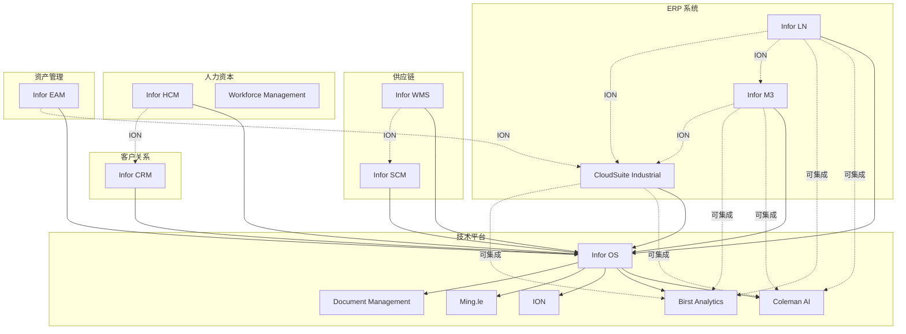

# Infor 产品生态系统

本页面展示 Infor 产品的完整生态系统，包括产品关系、集成矩阵、学习路径等。

## 产品关系图

下图展示了 Infor 主要产品之间的关系：



## 集成矩阵

下表展示了 Infor 主要产品之间的集成能力：

| 产品 | Infor LN | Infor M3 | CloudSuite Industrial | Infor WMS | Infor HCM | Infor EAM | Infor CRM |
|-------|-----------|-----------|----------------------|-------------|------------|------------|------------|
| **Infor LN** | - | ✅ (ION) | ✅ (ION) | ✅ (ION) | ✅ (ION) | ✅ (ION) | ✅ (ION) |
| **Infor M3** | ✅ (ION) | - | ✅ (ION) | ✅ (ION) | ✅ (ION) | ✅ (ION) | ✅ (ION) |
| **CloudSuite Industrial** | ✅ (ION) | ✅ (ION) | - | ✅ (ION) | ✅ (ION) | ✅ (ION) | ✅ (ION) |
| **Infor WMS** | ✅ (ION) | ✅ (ION) | ✅ (ION) | - | - | - | - |
| **Infor HCM** | ✅ (ION) | ✅ (ION) | ✅ (ION) | - | - | - | ✅ (ION) |
| **Infor EAM** | ✅ (ION) | ✅ (ION) | ✅ (ION) | - | - | - | - |
| **Infor CRM** | ✅ (ION) | ✅ (ION) | ✅ (ION) | - | ✅ (ION) | - | - |

✅ = 支持集成（通过 ION）  
- = 同一产品或不需要集成

## 产品升级路径

### 从 CloudSuite Industrial 升级到 Infor LN

| 升级原因 | 说明 |
|----------|----------|
| **企业规模增长** | 从 2,000 人增长到 5,000+ 人 |
| **多站点需求** | 需要复杂的多站点、多实体管理 |
| **功能需求** | 需要更高级的企业级功能 |

### 从离散制造到流程制造

| 场景 | 说明 |
|------|----------|
| **企业转型** | 从离散制造转型到流程制造（如汽车制造商开始生产电池电解液） |
| **产品线扩展** | 添加流程制造产品线 |

需要实施 **Infor M3** 或添加 M3 模块。

## 学习路径

### 初学者路径

1. **了解 Infor 产品生态系统**
   - 阅读本网站的产品分类和介绍
   - 了解 Infor OS 平台的核心能力

2. **选择适合的产品**
   - 根据企业规模、行业、业务需求选择
   - 参考[按业务功能分类](products/by-function/)页面

3. **学习基本概念**
   - 注册 Infor 培训课程
   - 阅读官方文档和快速入门指南

### 实施顾问路径

1. **掌握核心产品**
   - 深入学习至少一款 ERP 产品（LN、M3 或 CloudSuite Industrial）
   - 获得产品认证

2. **学习集成技术**
   - 掌握 Infor ION 集成平台
   - 学习 REST API 和 SOAP API

3. **行业专业化**
   - 选择 1-2 个行业深度钻研（如汽车、食品饮料）
   - 了解行业特定需求和最佳实践

### 开发者路径

1. **学习 Infor OS 平台**
   - 掌握 Infor OS 的 API 和扩展机制
   - 学习 ION 集成开发

2. **掌握 API 集成**
   - REST API 开发
   - SOAP API 开发
   - 自定义连接器开发

3. **高级主题**
   - Coleman AI 集成开发
   - Birst Analytics 扩展开发
   - 自定义应用程序开发

## 技术架构

### Infor CloudSuite 架构

```
┌─────────────────────────────────────────────────┐
│                  Infor OS                   │
│  ┌──────────┐  ┌──────────┐  ┌────────┐ │
│  │ Coleman AI│  │ Birst    │  │ ION    │ │
│  │          │  │ Analytics│  │        │ │
│  └──────────┘  └──────────┘  └────────┘ │
│  ┌──────────┐  ┌──────────┐  ┌────────┐ │
│  │ Ming.le  │  │ Document │  │ Security│ │
│  │          │  │ Management│  │        │ │
│  └──────────┘  └──────────┘  └────────┘ │
└─────────────────────────────────────────────────┘
         ↓                ↓                 ↓
┌──────────────┐ ┌──────────────┐ ┌──────────────┐
│ Infor LN     │ │ Infor M3     │ │ CloudSuite   │
│              │ │              │ │ Industrial   │
└──────────────┘ └──────────────┘ └──────────────┘
         ↓                ↓                 ↓
┌─────────────────────────────────────────────────┐
│          AWS 云基础设施（多租户）            │
└─────────────────────────────────────────────────┘
```

### 集成架构

```
┌─────────────┐       ┌─────────────┐
│ Infor ERP   │       │ 第三方系统  │
│ (LN/M3/etc)│       │ (Bank/ etc) │
└──────┬──────┘       └──────┬──────┘
       │                    │
       └────────┬───────────┘
                ↓
         ┌─────────────┐
         │  ION        │
         │ (集成中间件) │
         └──────┬──────┘
                ↓
         ┌─────────────┐
         │ Infor OS    │
         │ (API 网关)  │
         └─────────────┘
```

## 合作伙伴生态系统

### 实施合作伙伴

Infor 拥有全球范围内的实施合作伙伴网络，提供：

- ✅ 实施和部署服务
- ✅ 定制开发服务
- ✅ 培训和变更管理
- ✅ 持续优化和支持

### 技术合作伙伴

技术合作伙伴提供扩展和集成解决方案：

- ✅ 行业特定扩展
- ✅ 第三方系统集成
- ✅ 硬件和设备集成
- ✅ 数据分析和 AI 扩展

### 如何成为合作伙伴

访问 [Infor 合作伙伴门户](https://www.infor.com/partners) 了解更多信息。

---

**💡 需要帮助？** 访问 [Infor 客户门户](https://www.infor.com/support) 获取支持。
