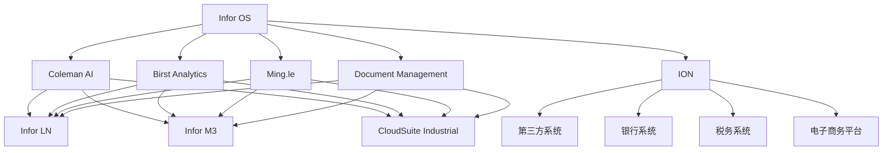

# 按技术平台分类

本页面按**技术平台**分类展示 Infor 产品，帮助您了解 Infor 的技术架构和平台能力。

## Infor OS 平台

**Infor 云操作系统** - 所有 Infor 产品的统一运行平台。

### 平台概述

Infor OS 是 Infor 产品的核心云平台，提供统一的技术架构、API 网关、集成能力和用户体验。

### 核心能力

| 能力 | 说明 |
|------|----------|
| **云基础设施** | 基于 AWS 的云基础设施 |
| **API 网关** | RESTful API 和 SOAP API 管理 |
| **数据管理** | 统一数据模型和集成 |
| **用户体验** | 统一的用户界面和导航 |
| **安全** | 统一的安全模型和身份管理 |

### 支持的产品

- ✅ 所有 CloudSuite 产品（Infor LN、M3、CloudSuite Industrial）
- ✅ Infor HCM
- ✅ Infor EAM
- ✅ Infor CRM
- ✅ 所有 Infor 云产品

### 详细了解

- [Infor OS 详情](../../ecosystem/)
- [官方文档](https://docs.infor.com/os)

---

## Coleman AI

**人工智能平台** - Infor 的人工智能和机器学习平台。

### 功能特性

| 功能 | 说明 |
|------|----------|
| **对话式 AI** | 常见 ERP 查询和操作的聊天机器人界面 |
| **预测分析** | 需求预测、维护预测、异常检测 |
| **流程自动化** | AP 发票的智能文档处理、自动分类 |
| **建议** | 基于运营数据模式的建议操作 |
| **图像识别** | 视觉质量检验（新兴能力） |

### 集成产品

- ✅ Infor LN（可集成）
- ✅ Infor M3（可集成）
- ✅ CloudSuite Industrial（可集成）
- ✅ 所有 CloudSuite 产品

### 详细了解

- [Coleman AI 详情](../../ecosystem/)
- [官方文档](https://docs.infor.com/coleman)

---

## Birst Analytics

**商业智能平台** - Infor 的数据分析和可视化平台。

### 功能特性

| 功能 | 说明 |
|------|----------|
| **预建仪表板** | 每个 CloudSuite 版本都有的预建仪表板（行业特定 KPI） |
| **临时报告** | 具有拖放报告构建器 |
| **数据发现** | 具有网络化分析（Birst 连接分散数据的架构） |
| **移动分析** | 具有响应式仪表板 |
| **自动洞察** | 突出趋势和异常 |
| **数据混合** | 结合 Infor 数据与外部数据源 |

### 集成产品

- ✅ 所有 CloudSuite 产品
- ✅ 可作为独立 BI 工具使用

### 详细了解

- [Birst Analytics 详情](../../ecosystem/)
- [官方文档](https://docs.infor.com/birst)

---

## ION (Intelligent Open Network)

**集成中间件** - Infor 的集成平台和消息传递系统。

### 功能特性

| 功能 | 说明 |
|------|----------|
| **应用程序间集成** | Infor 模块之间以及与第三方系统之间的集成 |
| **基于事件的消息传递** | 发布/订阅架构 |
| **预构建连接器** | 常见集成场景的预构建连接器（EDI、银行、税务、电子商务） |
| **API 管理** | 自定义集成的 API 管理 |
| **数据湖** | 用于聚合跨 Infor 应用程序数据 |
| **工作流编排** | 跨应用程序业务流程的工作流编排 |

### 集成能力

- ✅ 与第三方 ERP 系统集成
- ✅ 与银行系统集成（支付、对账）
- ✅ 与税务系统集成
- ✅ 与电子商务平台集成
- ✅ EDI 集成

### 详细了解

- [ION 详情](../../ecosystem/)
- [官方文档](https://docs.infor.com/ion)

---

## Ming.le

**协作平台** - Infor 的社交协作和统一导航层。

### 功能特性

| 功能 | 说明 |
|------|----------|
| **统一导航** | CloudSuite 应用程序的统一导航 |
| **社交协作** | 具有活动流和团队工作区 |
| **通知和警报** | 跨所有模块的通知和警报 |
| **上下文敏感访问** | 相关信息和操作的上下文敏感访问 |

### 集成产品

- ✅ 所有 CloudSuite 产品
- ✅ 提供统一的用户体验

### 详细了解

- [Ming.le 详情](../../ecosystem/)
- [官方文档](https://docs.infor.com/mingle)

---

## Document Management

**文档管理系统** - Infor 的电子文档存储和管理系统。

### 功能特性

| 功能 | 说明 |
|------|----------|
| **电子文档存储** | 具有版本控制 |
| **文档工作流** | 用于审批路由的文档工作流 |
| **OCR/AI 驱动** | 用于发票和其他业务文档的 OCR/AI 驱动的文档捕获 |
| **跨应用程序集成** | 与所有 CloudSuite 模块集成，用于将文档附加到事务 |

### 集成产品

- ✅ 所有 CloudSuite 产品
- ✅ AP（发票文档）
- ✅ 质量管理（质量记录）
- ✅ 所有需要文档管理的模块

### 详细了解

- [Document Management 详情](../../ecosystem/)
- [官方文档](https://docs.infor.com/document-management)

---

## 平台关系图

---

**💡 提示**：您也可以按[业务功能](by-function/)、[产品线](by-product-line/)或[行业](by-industry/)浏览产品。
